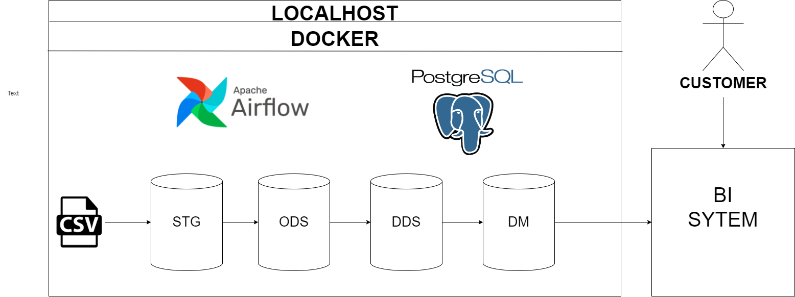
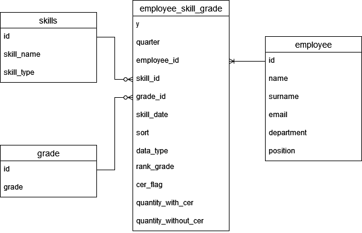

Задача:
Извлечь данные из источника (CSV файлы) и разработать витрину данных.

1. Скачайте проект.

2. Создайте необходимые папки:
```bash
mkdir -p ./dags ./logs ./plugins ./config
echo -e "AIRFLOW_UID=$(id -u)" > .env
```
3. Инициализируйте Redis и системную БД Postgres:
```bash
docker compose up airflow-init
```

4. Запустите Airflow:
```bash
docker-compose up
```
5. Создание схем, таблиц, представлений не добавлено в оркестрацию. Скрипты для создания слоев находятся в папке DDL.
ct - create table
cv - create view
cle - create error log table

6. Папка etls содержит SQL-скрипты, обернутые в Python переменные.

7. Схема DM.

